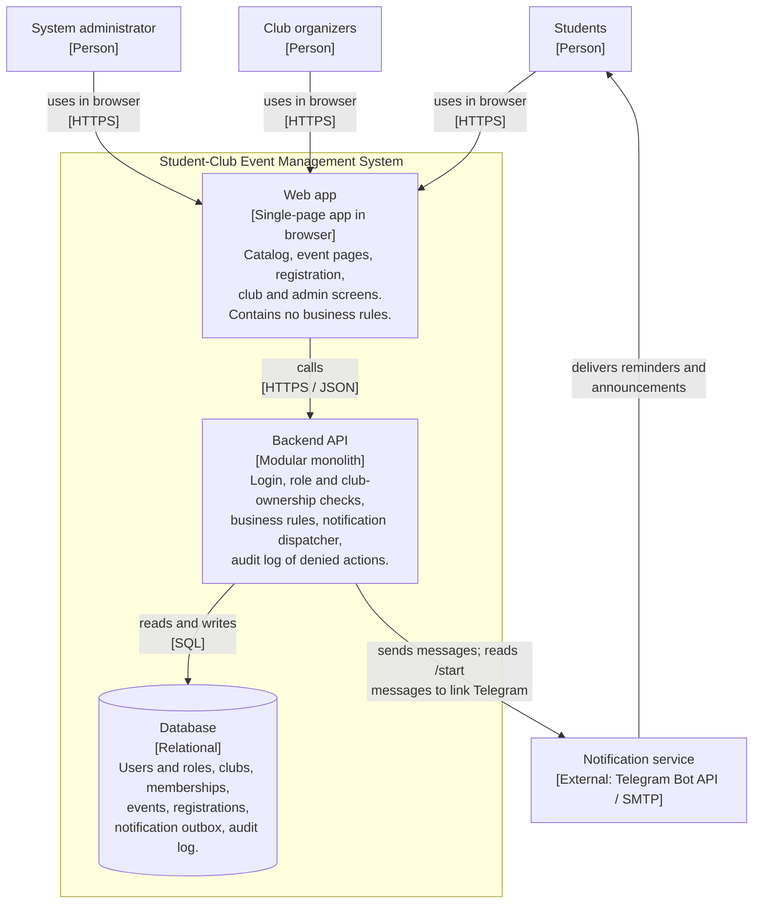

# Container Diagram (C4 level 2)

```mermaid
flowchart TB
    S["Students<br/>[Person]"]
    O["Club organizers<br/>[Person]"]
    A["System administrator<br/>[Person]"]

    subgraph SYS["Student-Club Event Management System"]
        WEB["Web app<br/>[Single-page app in browser]<br/>Catalog, event pages, registration,<br/>club and admin screens.<br/>Contains no business rules."]
        API["Backend API<br/>[Modular monolith]<br/>Login, role and club-ownership checks,<br/>business rules, notification dispatcher,<br/>audit log of denied actions."]
        DB[("Database<br/>[Relational]<br/>Users and roles, clubs, memberships,<br/>events, registrations,<br/>notification outbox, audit log.")]
    end

    N["Notification service<br/>[External: Telegram Bot API / SMTP]"]

    S -- "uses in browser<br/>[HTTPS]" --> WEB
    O -- "uses in browser<br/>[HTTPS]" --> WEB
    A -- "uses in browser<br/>[HTTPS]" --> WEB
    WEB -- "calls<br/>[HTTPS / JSON]" --> API
    API -- "reads and writes<br/>[SQL]" --> DB
    API -- "sends messages; reads /start<br/>messages to link Telegram" --> N
    N -- "delivers reminders and<br/>announcements" --> S
```

**Legend.** Boxes inside the frame are containers of our system. Boxes outside are people and the external system.
