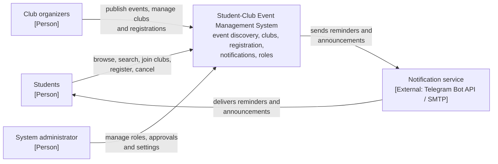

# System Context Diagram (C4 level 1)

```mermaid
flowchart LR
    S["Students<br/>[Person]"]
    O["Club organizers<br/>[Person]"]
    A["System administrator<br/>[Person]"]
    SYS["Student-Club Event Management System<br/>event discovery, clubs, registration,<br/>notifications, roles"]
    N["Notification service<br/>[External: Telegram Bot API / SMTP]"]

    S -- "browse, search, join clubs,<br/>register, cancel" --> SYS
    O -- "publish events, manage clubs<br/>and registrations" --> SYS
    A -- "manage roles, approvals<br/>and settings" --> SYS
    SYS -- "sends reminders and<br/>announcements" --> N
    N -- "delivers reminders and<br/>announcements" --> S
```
